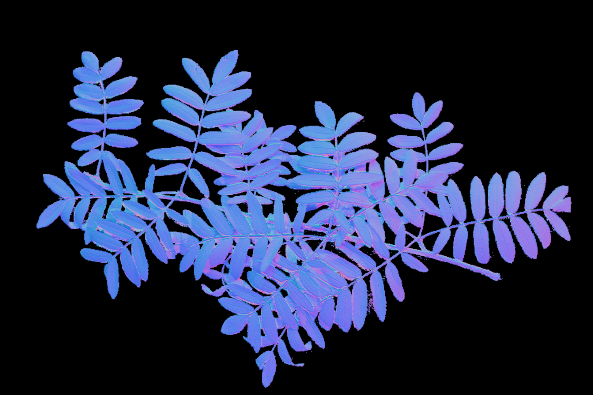
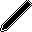
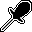
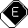
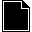
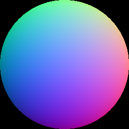

# The normal map app

This application is intended to help with the creation of normal maps. The app has the following features:
- Generating normal maps from a series of images with varying light directions.
- An image editor designed for creation of new normal maps by manual drawing and combining other normal maps.
- Browsing and sharing normal maps with other users.
- Previewing the effects of normal maps in 3D viewer with a lighting shader.

## What is a normal map?
In short a normal map is surface normal data encoded in an image.
A surface normal is a direction that is tangent to a surface, which means that for a flat surface like a table the surface normal would be pointing straight up.

When applying a lighting shader to a surface the normal is required to calculate how light should be reflected of it.
With a specific surface normals for each pixel in a texure, light reflection can be calculated separately for each pixel.
In order to provide a shader with per pixel surface normals, they can be encoded into an image, which can then be passed to the shader.

The color channels red, green and blue represent the x, y and z components of the surface normal vectors.
The more red a pixel is the more the surface normal points toward the right.
If the red is less than half it will instead point towards the left.
Same goes for the y and z components with the green and blue channels.

Below is a normalmap of a branch of leaves.

The black part of the normal map is what has been masked out and will be transparent when rendered.
An interactive view can be found on the frontpage of the application within the instructions. [Link to deployed app](https://normalmap.pur-pul.net/)

## Photometric stereo
This application utilizes a photometric stereo algorithm that allows generation of normal maps from a list of images.
The images are to be taken of the same of the same subject with the same angle, but with varying light directions.
By specifying the direction of the light in each image the alogrithm calculates the surface normals for each pixel in the resulting image.

### Taking the pictures
To generate a normal map two or more pictures of the subject will be required, but the more pictures the better the result.
Keep in mind that there is a default limit of 15 pictures per upload and also a certain file size limit.
For best results the camera and the subject need to pe perfectly still between the pictures, otherwise the normal map will end up blurry.

When taking the pictures move a light source around the subject making sure it stays at about the same distance.
For each picture take note of what direction the light source is in relation to the subject.
The light source could for example be moved in a circle around the subject to make it easier to remember.
While the pictures can be sorted by creation date, I recommend numbering them in the order they were taken.

### Light directions
The light direction are selected in an interactive 3D view.
The yellow lines represent the direction of the light.
To change the direction click somewhere on the blue sphere.
To rotate the view click and hold outside the blue sphere and drag.

### Drawing a mask
Drawing a mask is optional, but allows masking out unneccessary content from the background of the source images.
The default mask keeps everyhing, but it can be edited.
Draw out black on the parts of the image that are to masked out and white on the ones to keep.
In the mask editor one of the images can be overlayed to make it easier to align the mask.

## Normal map editor

### Tools
The normal map editor features the following tools:

 **Pencil with adjustable width.**

 **Pipette which can be used to select a color from the normal map being edited.**

 **Eraser for erasing parts of the normal map.**

 **Shape tool for placing other normal maps like stickers on the canvas. This can be used to combine normal maps.**
- To use the shape tool draw a rectangle: First click and hold to select the first corner. Then drag and release to select the opposite corner of the shape. The normal map will be drawn to the canvas with the aspect ratio of the rectangle that was drawn.

**A color picker that that allows picking a color from a normal mapped sphere.**

- By clicking on the part of the sphere which matches the angle of the surface to be mapped, the appropriate normal encoded as a color is selected for the pencil.

**A layer selector**
- Up to five layers can be used. Layers can be hidden by clicking the 👁 button. Or deleted by clicking the red X button.